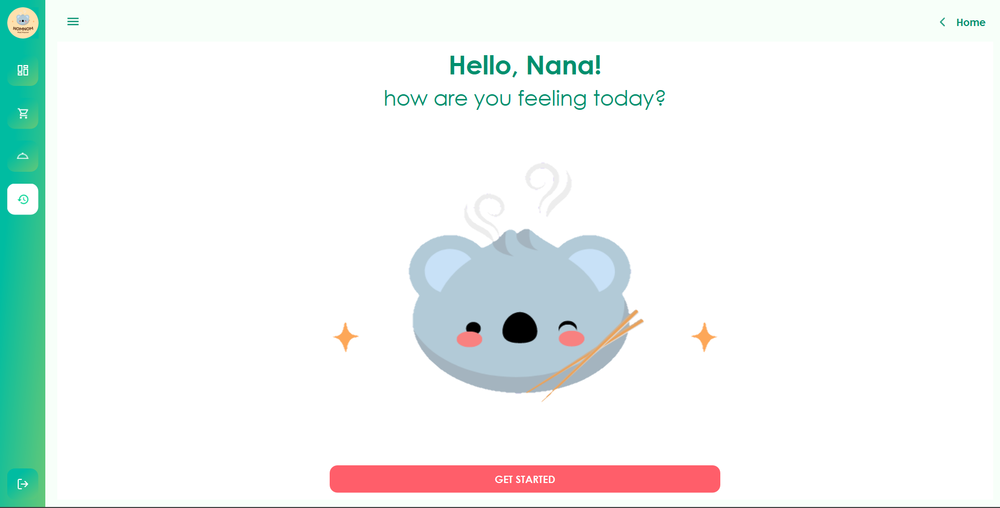
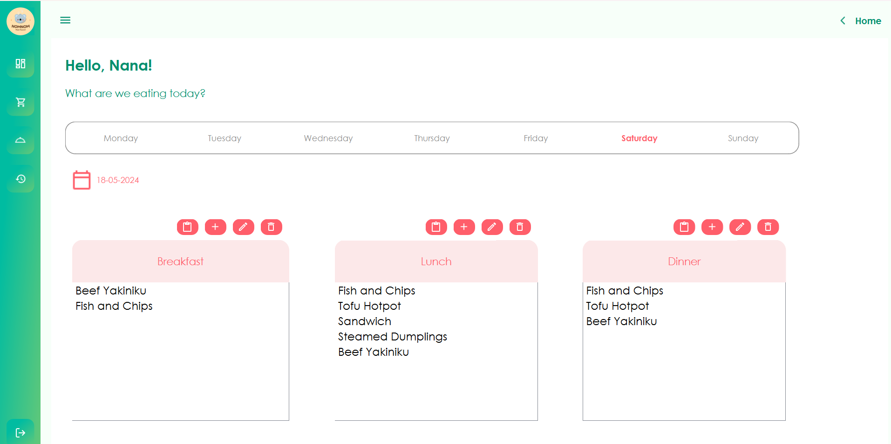
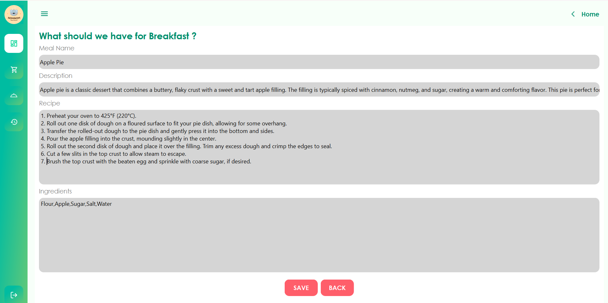
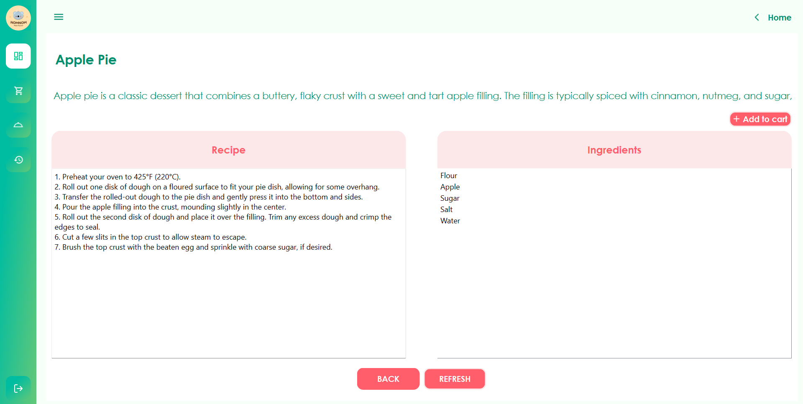
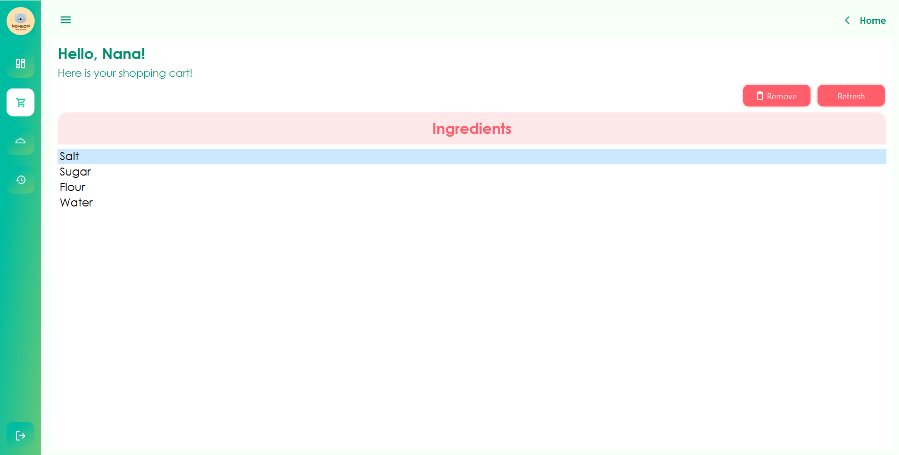

# IF2250-2024-K03-07-NomNom

> **Tugas Besar Rekayasa Perangkat Lunak 2024**

> NomNom is a user-friendly app designed for efficient and organized daily meal planning. It enables users to schedule meals, view detailed recipes, and manage shopping lists seamlessly. With no need for an internet connection or authentication, NomNom offers convenient and flexible access to meet diverse meal planning needs.



## Table of Contents

- [Technologies Used](#technologies-used)
- [Pre Requirement](#pre-requirement)
- [How To Run](#how-to-run)
- [Screenshots](#screenshots)
- [Contact](#contact)

## Technologies Used

- Python
- PyQt5
- PySide6

## Pre Requirement

- Python (including pip)
- venv

## How To Run

1. Set up virtual environment
2. Install dependencies
3. Navigate to the `src` folder
4. Run the program
   
#### Setup Virtual Environtmet

Install venv

```bash
pip install venv
```

Create venv

```bash
virtualenv venv
```

Activate venv

```bash
source venv/Scripts/activate  # Windows (bash)
source venv/bin/activate      # WSL / Linux / Mac
```

#### Install the required dependencies

```bash
pip install -r requirements.txt
```

#### Run program

```bash
python main.py
```

#### Deactivate Virtual Environment

```bash
deactivate
```

## Screenshots





## Authors

Created by

- [@caernations](https://github.com/Maharanish) 13522134 Shabrina Maharani
- [@caernations](https://github.com/attaramajesta) 13522139 - Attara Majesta Ayub
- [@caernations](https://github.com/caernations) 13522140 Yasmin Farisah Salma
- [@caernations](https://github.com/auraleaas) 13522148 - Auralea Alvinia Syaikha 
- [@caernations](https://github.com/Rapa285) 13522162 - Pradipta Rafa Mahesa